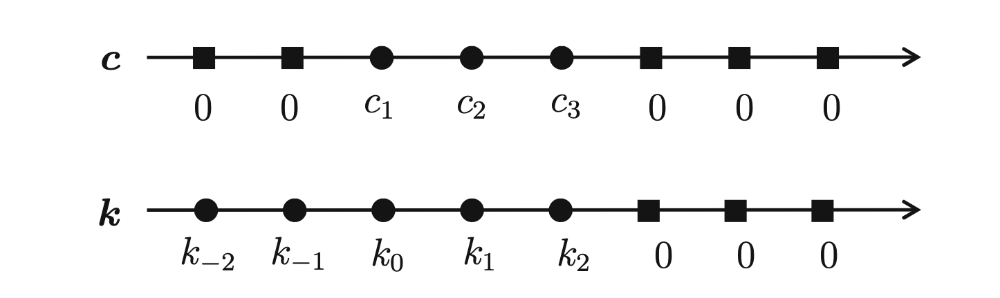

# Implementation {#tensorflowImplementation}

## Exact Kernel Density Estimation

The implementation of a simple Kernel Density Estimation in TensorFlow is straightforward. As described in the original Tensorflow Probability Paper[@googleTFP], a KDE can be constructed by using its MixtureSameFamily Distribution.

```{python}

from tensorflow_probability import distributions as tfd

f = lambda x: tfd.Independent(tfd.Normal(loc=x, scale=1.))
n = x.shape[0].value

kde = tfd.MixtureSameFamily(
    mixture_distribution=tfd.Categorical(
        probs=[1 / n] * n),
    components_distribution=f(x))
```

Interestingly, due to the smartly capsulated structure of TensorFlow Probability we can use any distribution of the loc-scale family type as a Kernel, if there exists an implementation for it in TensorFlow Probability. If the used Kernel has bounded support, the implementation proposed in this paper allows to specify the support upon instanciation of the class. If the Kernel has infinite support (like a Gaussian kernel i. e.) a practical support estimate is calculated by searching for approximative roots with the Brent's method[@brent1971algorithm] implemented in TensorFlow the python package `tf_quant_finance` by Google. This allows us to speed up the calculation

However calculating an exact Kernel Density Estimation is not always feasible as this can take a long time with a huge collection of events, especially in high energy physics. By implementing it in TensorFlow we already get a significant speed up compared to implementations in native Python, since most of TensorFlow is actually implemented in C++ and the code is optimized before running. The computational complexity however, remains the same nonetheless.

$$
\begin{equation}
\widehat{f}_h(x) = \frac{1}{nh} \sum_{k=1}^n K\Big(\frac{x-x_k}{h}\Big)
(\#eq:kde)
\end{equation}
$$

The computational complexity of the basic exact KDE above is $\mathcal{O}(nm)$ where $n$ is the number of sample points to estimate from and $m$ is the number of evaluation points (the points where you want to calculate the estimate).

To combat this complexity several methods exist. 

## Simple and linear Binning

The most straightforward way to decrease runtime is by limiting the number of sample points. This can be done by a binning routine, where the values at a smaller number of regular grid points are estimated from the original large number of sample points.
Given a set of sample points $X = \{x_0, x_1, ..., x_k, ..., x_{n-1}, x_n\}$ with weights $w_k$ and a set of equally spaced grid points $G = \{g_0, g_1, ..., g_l, ..., g_{n-1}, g_M\}$ where $N < n$ we can assign an estimate (or a count) $c_l$ to each grid point $g_l$ and use the newly found $g_l$'s to calculate the kernel density estimation instead. This brings the computational complexity down to $\mathcal{O}(Nm)$. Depending on the number of grid points $N$ the estimate is either more accurate and slower or less accurate and faster. However as we will see in the comparison chapter later as well, even a grid of size $1024$ is enough to capture the true density with high accuracy on a million data points.[@KDEpyDoc].

As described in the excellent overview by Artur Gramacki[@gramacki2018fft] simple binning or linear binning can be used, although the last is often preferred since it is more accurate and the difference in computational complexity is negligible.

Simple binning is just the standard process of taking a weighted histogram that is divided by the sum of the sample points weights (normalization). In one dimension simple binning is binary in that it assigns a data points weight ($1$ for an unweighted historgram) either to the bin left or right of itself. Linear binning on the other hand assigns a fraction of the whole weight to both bins on either side, proportional to the closeness of bin and data point in relation to the bin width.

Mathematically linear binning in one dimension can be calculated like this:

$$
\begin{equation}
c_l = c(g_l) = \sum_{\substack{x_k \in X\\g_l < x_k < g_{l+1}}} \frac{g_{k+1}-x_k}{g_{l+1} - g_l} \cdot w_k + \sum_{\substack{x_k \in X\\g_{l-1} < x_k < g_l}} \frac{x_k - g_{l-1}}{g_{l+1} - g_l} \cdot w_k
(\#eq:linbin)
\end{equation}
$$

Implementing linear binning efficiently with TensorFlow is a bit tricky since loops should be avoided. However with some inspiration from the excellent KDEpy package[@KDEpy] which implements a kernel density estimation in native python/cython this can be done without using loops at all. By transforming the data such that every data point $x_k$ can be described by an integral part (corresponding to its nearest left grid point number $l$) plus some fractional part (corresponding to the distance between grid point $g_l$ and data point $x_k$) and applying `tf.math.bincount` twice to the transformed integral part weighting it with the fractional part times the initial weight.

The kernel density estimation can then be calculated as a mixture distribution of kernels located at the grid points, weighted with their associated grid count.
$$
\begin{equation}
\widehat{f}_h(x) = \frac{1}{nh} \sum_{l=1}^N c_l \cdot K\Big(\frac{x-g_l}{h}\Big)
(\#eq:kdebin)
\end{equation}
$$


## Using convolution and the Fast Fourier Transform

With binning implemented, another technique to speed up the computation is rewriting the Kernel Density Estimation as convolution operation between the kernel and the grid counts calculated by the binning routine. By using the fact that a convolution is just a multiplication in Fourier space one can reduce the computational complexity down to $\mathcal{O}(\log{N} \cdot m)$.[@gramacki2018fft]

Using the equation \@ref(eq:kdebin) from above but also only evaluating it at grid points gives us

$$
\begin{equation}
\widehat{f}_h(g_j) = \frac{1}{nh} \sum_{l=1}^N c_l \cdot K\Big(\frac{g_j-g_l}{h}\Big) = \frac{1}{nh} \sum_{l=1}^N k_{j-l} \cdot c_l
(\#eq:binkdegrid)
\end{equation}
$$
where $k_{j-l} = K(\frac{g_j-g_l}{h})$. 
If we set $c_l = 0$ for all $l$ not in the set $\{1, ..., N\}$ and notice that $K(-x) = K(x)$ we can extend equation \@ref(eq:binkdegrid) to a discrete convolution as follows

$$
\begin{equation}
\widehat{f}_h(g_j) = \frac{1}{nh} \sum_{l=-N}^N k_{j-l} \cdot c_l = \vec{c} \ast \vec{k}
(\#eq:binkdeconv)
\end{equation}
$$
where the two vectors look like this

```{r, ckFigure, fig.cap="Vectors $\vec{c}$ and $\vec{k}$"}

```

By using the well known convolution theorem we can fourier transform $\vec{c}$ and $\vec{k}$ multiply them and inverse fourier transform them back into real space. 

In TensorFlow convolutions are efficiently implemented already in this way if we use `tf.nn.conv1d`. In benchmarking using this method proved significantly faster than using `tf.signal.rfft` and `tf.signal.irfft` to transform, multiply and inverse transform the vectors, which is implemented as an alternative as well.

This algorithm is implemented as its own class since it does not represent a complete mixture distribution anymore but calculates just the density distribution values at the speficied grid points. To still infer values for other points in the range of $x$ `tfp.math.interp_regular_1d_grid` is used which computes a linear interpolation of values between the grid.

## Improved Sheather Jones Algorithm

A different take on Kernel Density Estimators is described in the paper 'Kernel density estimation by diffusion' by Botev et al.[@botev2010kernel]. The authors present a new adaptive kernel density estimator based on linear diffusion processes which also includes an estimation for the optimal bandwidth.

The algorithm is quite difficult to understand, a detailed explanation is given in the 'Handbook of Monte Carlo Methods'[@kroese2013handbook] by the original paper authors. However the general idea is briefly sketched below.

A critical insight is that the Gaussian kernel density estimator $\widehat{f}_{h,norm}$ is the solution of the partial differential equation

$$
\begin{equation}
\frac{\partial}{\partial t} \widehat{f}_{h,norm}(x,t) = \frac{1}
{2} \frac{\partial^2}{\partial x^2} \widehat{f}_{h,norm}(x,t),\space t>0 (\#eq:heatpde)
\end{equation}
$$
with $x \in \mathbb{R}$, $\lim_{x\rightarrow \pm \infty}{\widehat{f}_{h,norm}(x,t) = 0}$ and initial condition $\widehat{f}_{h,norm}(x,0) = \Delta(x)$, where $\Delta(x) = \frac{1}{N} \sum_{k=0}^N \delta_{x_k}(x)$ us the empirical density of the given sample points $X = \{x_0, x_1, ..., x_k, ..., x_{n-1}, x_n\}$ and $\delta_{x_k}(x)$ is the Dirac measure at $x_k$. This means the kernel density estimator can be obtained by evolving the solution of the partial differential equation \@ref(eq:heatpde) up to time $t$. The key observation that \@ref(eq:heatpde) can be solved on a finite domain efficiently using the fast cosine transform - an FFT-related transform.[@kroese2013handbook]

The optimal bandwidth is often defined as the one that minimizes the mean integrated square error($MISE$)

$$
\begin{equation}
MISE(t) = \mathbb{E}_f\int [\widehat{f}_{h,norm}(x,t) - f(x)]^2 dx
(\#eq:mise)
\end{equation}
$$

An asymptotically optimal value $t^{\ast}$ which minimizes a first-order asymptotic appoximation of the $MISE$ is then given by[@kroese2013handbook]

$$
t^{\ast} = \Big( \frac{1}{2N\sqrt{\pi} \| f''\|^2}\Big)^{\frac{2}{5}}
(\#eq:tstar)
$$

Using the fact that $\|f^{(j)}\|^2 = (-1)^j \mathbb{E}_f[f^{(2j)}(X)], \space j\geq 1$ and an initial estimation for $\|\widehat{f}_{h,norm}^{(l+2)}\|^2$  for some $l \geq 3$ one can then iteratively get a an estimation for $\|\widehat{f}_{h,norm}^{(2)}\|^2$ which can then be used to estimate $t^{\ast}$ instead of $\|f''\|^2$. According to their handbook $l = 7$ is a suitable value to yield good practical results.

The improvment compared to the standard Sheather-Jones plug-on method[@sheather1991reliable] consists in the fact that to compute the initial estimation of $\|\widehat{f}_{h,norm}^{(l+2)}\|^2$ is calculated by solving the partial differental equation using the fast cosine transform as described above, eliminating the need to assume normally distributed data for the initial estimate and leading improved performance, especially for density distributions that are far from normal as seen in the next chapter.

The implementation of the algorithm in TensorFlow proposed in this paper was also inspired a lot by the python package KDEpy[@KDEpy] and uses Brent's method[@brent1971algorithm] to find roots implemented in TensorFlow the python package `tf_quant_finance` as well.