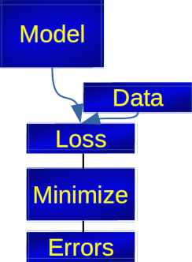

```{r setup, include=FALSE, cache=TRUE}
options(htmltools.dir.version = FALSE)
library('reticulate')
use_condaenv('ba-thesis')
```

```{r xaringan-themer, include=FALSE, warning=FALSE}
library(xaringanthemer)
style_mono_light(base_color = "#23395b", outfile='./docs/presentation/css/xaringan-themer.css')
```

```{python, pythonSetup, echo = FALSE, eval=TRUE, cache=FALSE}
import warnings
warnings.filterwarnings('ignore')

import os
os.environ['TF_CPP_MIN_LOG_LEVEL'] = '2'

from tf_kde.benchmark import runner
from matplotlib import pyplot as plt
import pandas as pd

distributions_to_evaluate = [
    'Gaussian',
    'Uniform',
    'Bimodal',
    'SkewedBimodal',
    'Claw',
    'AsymmetricDoubleClaw'
]

xlim = [-8, 8]

unrestricted_runtimes = pd.read_pickle('./benchmark/cpu_macbook_hofmeyr/unrestricted_runtimes.pkl')
restricted_runtimes = pd.read_pickle('./benchmark/cpu_macbook_hofmeyr/restricted_runtimes.pkl')

unrestricted_estimations = pd.read_pickle('./benchmark/cpu_macbook_hofmeyr/unrestricted_estimations.pkl')
restricted_estimations = pd.read_pickle('./benchmark/cpu_macbook_hofmeyr/restricted_estimations.pkl')

```

class: inverse, center, middle

# Experimental data and interpretation

???

- Suppose we have measured data experimentally
- How probable are certain types of events?

---

# Parametric fitting

.total-center[
Parametric function: 

\begin{equation*}
y = f(x,a,b,c) 
\end{equation*}

Least squares:

\begin{equation*}
\min_{a, b, c}\{\sum_{k=1}^{n}(f(x_i, a, b, c) - y_i)^2 \}
\end{equation*}
]

???

- Parametric fitting (y=f(a,b,c, x), find a, b, c)
- What if parametric fitting is not applicable? (CERN: Huge data, complex interactions)
- Non-parametric fitting

---
# Histograms

.align-bottom[

]

???

- Divide into equal sized bins

---
# Histograms

.align-bottom[

]

???

- Bin count defines height of histogramm

---
class: inverse, center, middle

# Kernel Density Estimation

---

# Kernel Density Estimation

... !TODO: KDE animation

???


---

# Kernel Density Estimation

.total-center[
\begin{equation*}
\widehat{f}_h(x) = \frac{1}{nh} \sum_{k=1}^n K\Big(\frac{x-x_k}{h}\Big)
\end{equation*}
]

???

- $f$ is the real distribution we want to approximate
- $\widehat{f}_h(x)$ is the kernel density estimator
- $h$ is the bandwidth parameter, which controls how wide the kernels are spread
- $n$ is the number of samples

---

# Kernel Density Estimation

## Linear Binning

...

---

# Kernel Density Estimation

## Fast Fourier Transform

---

# Kernel Density Estimation

## Improved Sheather Jones

...

---

# Kernel Density Estimation

## Hofmeyr

...

---

class: inverse, center, middle

# Implementation

---

# TensorFlow

Addition in Python:

.pull-left2[
```{python}
a = 3
b = 5
c = a + b

print(c)
```
]

---

# TensorFlow

Addition in TensorFlow:

.pull-left2[
````{python}
import tensorflow as tf
tf.compat.v1.disable_eager_execution()
  
a = tf.constant(3, dtype=tf.int32) 
b = tf.constant(5, dtype=tf.int32) 
c = tf.add(a, b) 

print(c)
  
session = tf.compat.v1.Session()
session.run(c)
session.close()
````
]

.pull-right2[

]

---

# Zfit

.pull-left2[

]

.pull-right2[

]

---

# New methods

Four new proposed methods:

- `ZfitBinned`: linear binning


- `ZfitFFT`: Fast Fourier Transformation


- `ZfitISJ`: Improved Sheather-Jones algorithm by Botev et al.


- `ZfitHofmeyr`: Specialized kernel functions ($poly(x)\cdot\exp(x)$) by Hofmeyr


---

class: inverse, center, middle

# Comparison

---

```{python showDistributions, echo=FALSE, eval=TRUE, fig.cap="Test distributions used", fig.align='center', out.width='74.375%', dpi=300, cache=TRUE}
figure, axes = runner.plot_distributions(distributions_to_evaluate, xlim)
figure
```

???

---

```{python compareZfitKDEpyEstimations, echo=FALSE, eval=TRUE, fig.cap="KDE using different methods (10'000 samples)", fig.align='center', out.width='85%', dpi=300, cache=TRUE}
figure, axes = runner.plot_estimations(unrestricted_estimations, distributions_to_evaluate, 1e4, ['ZfitBinned', 'ZfitFFT', 'ZfitISJ', 'ZfitHofmeyrK1withCpp', 'KDEpyFFT'])
figure
```

???

---

```{python compareZfitKDEpyErrors, echo=FALSE, eval=TRUE, fig.cap="Integrated square errors (10'000 samples)", fig.align='center', out.width='85%', dpi=300, cache=TRUE}
figure, axes = runner.plot_integrated_square_errors(unrestricted_estimations, distributions_to_evaluate, ['ZfitBinned', 'ZfitFFT', 'ZfitISJ', 'ZfitHofmeyrK1withCpp', 'KDEpyFFT'])
figure
```

???


---

```{python compareZfitKDEpyRuntimeInstantiationGPU, echo=FALSE, eval=TRUE, fig.cap="Instantiation runtimes", fig.align='center', out.width='85%', dpi=300, cache=TRUE}
unrestricted_runtimes = pd.read_pickle('./benchmark/gpu_linux/unrestricted_runtimes.pkl')
figure, axes = runner.plot_runtimes(unrestricted_runtimes, distributions_to_evaluate, ['ZfitBinned', 'ZfitFFT', 'ZfitISJ', 'KDEpyFFT'], 'instantiation')
figure
```

???


---

```{python compareZfitKDEpyRuntimePDFGPU, echo=FALSE, eval=TRUE, fig.cap="Evaluation runtimes", fig.align='center', out.width='85%', dpi=300, cache=TRUE}
figure, axes = runner.plot_runtimes(unrestricted_runtimes, distributions_to_evaluate, ['ZfitBinned', 'ZfitFFT', 'ZfitISJ', 'KDEpyFFT'], 'pdf')
figure
```

???


---

```{python compareZfitRuntimePDFGPUwithoutKDEpy, echo=FALSE, eval=TRUE, fig.cap="Evaluation runtimes (without KDEpy)", fig.align='center', out.width='85%', dpi=300, cache=TRUE}
figure, axes = runner.plot_runtimes(unrestricted_runtimes, distributions_to_evaluate, ['ZfitBinned', 'ZfitFFT', 'ZfitISJ'], 'pdf')
figure
```

???


---

```{python compareZfitKDEpyRuntimeTotal, echo=FALSE, eval=TRUE, fig.cap="Total runtimes", fig.align='center', out.width='85%', dpi=300, cache=TRUE}
figure, axes = runner.plot_runtimes(unrestricted_runtimes, distributions_to_evaluate, ['ZfitBinned', 'ZfitFFT', 'ZfitISJ', 'KDEpyFFT'], 'total')
figure
```

???


---

# Findings

1. `ZfitHofmeyr`: Difficult to implement efficiently in TensorFlow due to recursion


2. Most performant implementations for evaluation: `ZfitFFT`, `ZfitISJ`


3. Most accurate method for spiky non-normal distributions:`ZfitISJ` (minor runtime cost compared to `ZfitFFT`)


4. Most performant implementations for total runtime and  $n \geq 10^8$: `ZfitBinned`, `ZfitFFT`

---

class: inverse, center, middle

# Conclusion

---

# Conclusion

---

class: inverse, center, middle

# Thank you for listening!


