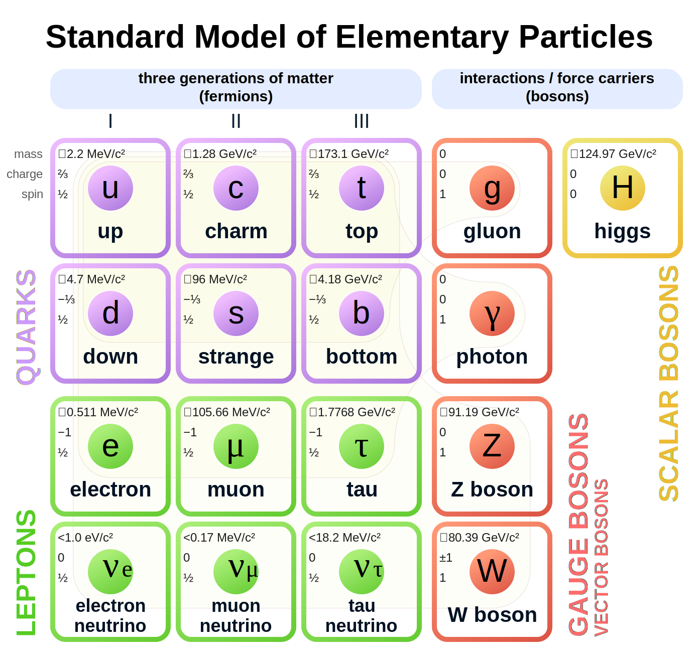
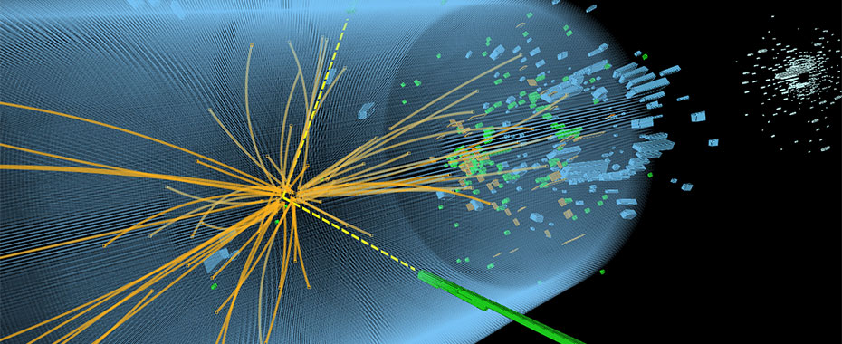
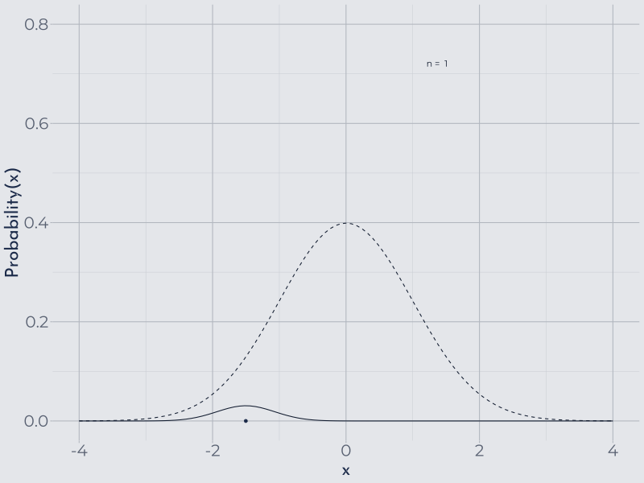
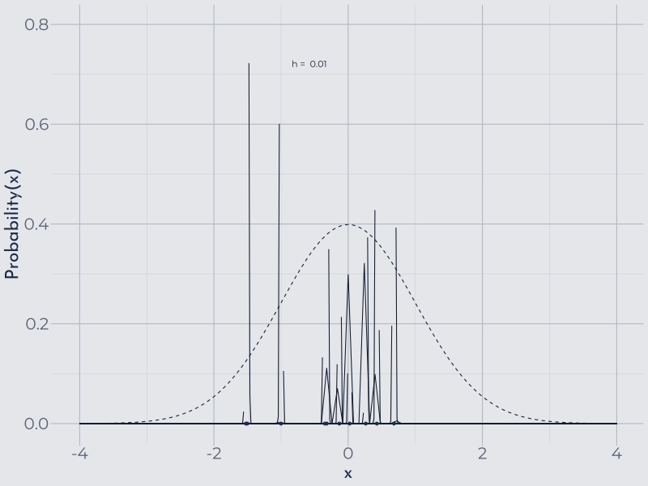
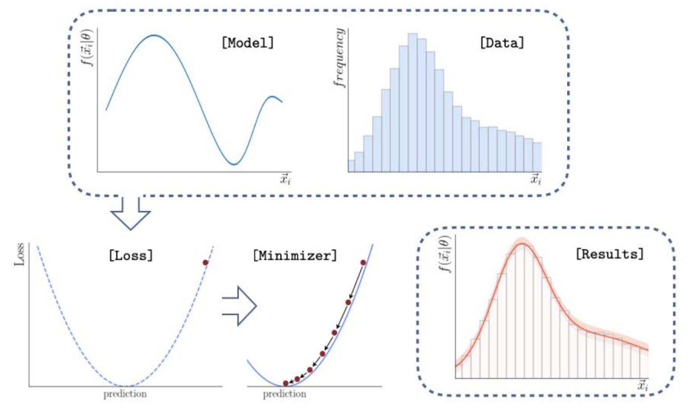
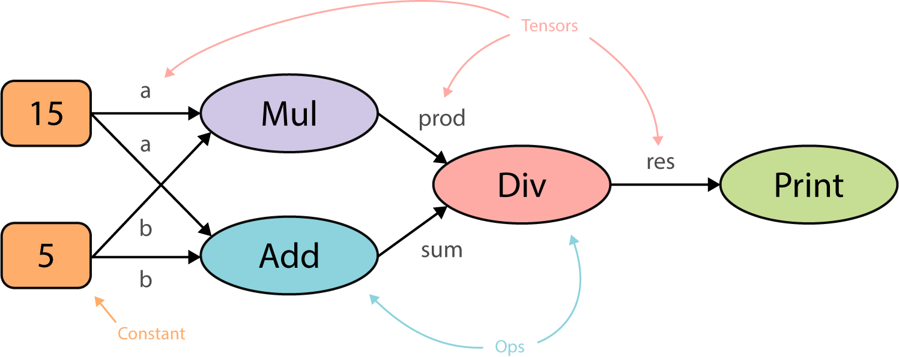
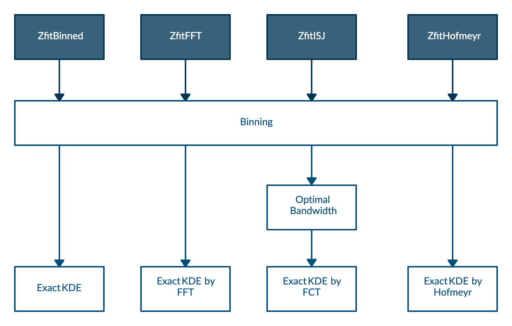
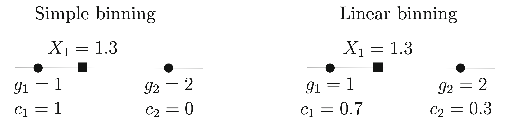

```{r setup, include=FALSE, cache=TRUE}
options(htmltools.dir.version = FALSE)
library('reticulate')
use_condaenv('ba-thesis')
```

```{r xaringan-themer-and-kde-plots, include=FALSE, warning=FALSE, fig.showtext=TRUE}
library(ggplot2)
library(gifski)
library(xaringanthemer)
style_mono_light(base_color = "#23395b", 
    header_font_google = google_font("Josefin Sans"),
    text_font_google   = google_font("Montserrat", "300", "300i"),
    code_font_google   = google_font("Fira Mono"),
    outfile='./docs/presentation/css/xaringan-themer.css'
)

set.seed(191919)

n <- 30
data = rnorm(n, mean = 0, sd = 1)
h <- bw.nrd0(data)

plot_kde <- function(data, h, n) {
    for (k in (1:n)) {
        dataf <- data.frame('x' = data[1:k])
        
        plot <- ggplot(dataf, aes(x=x)) +
            stat_function(fun = ~dnorm(.x, mean = 0, sd = 1), n = 101, linetype="dashed") + 
            geom_density(bw=h) +
            xlab("x") + xlim(-4, 4) +
            ylab("Probability(x)") + ylim(0, 0.8) + 
            geom_text(data=data.frame(), aes(label = paste('n = ', k), x = Inf, y = Inf), hjust = 10, vjust = 10)
        
        for(i in 1:nrow(dataf)){
            plot <- plot + stat_function(fun = function(...){1/n * dnorm(...)}, n = 101, args = list(mean = dataf[i,], sd = h)) 
        }
        
        plot <- plot + geom_point(aes(x=dataf$x, y=numeric(k))) + theme_xaringan()
        
        print(plot)
    }
}

save_gif(
  plot_kde(data, h, n),
  gif_file = "presentation/figures/kde.gif"
)

plot_kde2 <- function(data, n) {
    dataf <- data.frame('x' = data[1:n])

    for (h in seq(0.01, 0.8, by=0.02)) {
        
        plot <- ggplot(dataf, aes(x=x)) +
            stat_function(fun = ~dnorm(.x, mean = 0, sd = 1), n = 101, linetype="dashed") + 
            geom_density(bw=h) +
            xlab("x") + xlim(-4, 4) +
            ylab("Probability(x)") + ylim(0, 0.8) +
            geom_text(data=data.frame(), aes(label = paste('h = ', h), x = Inf, y = Inf), hjust = 10, vjust = 10)
        
        for(i in 1:nrow(dataf)){
            plot <- plot + stat_function(fun = function(...){1/n * dnorm(...)}, n = 101, args = list(mean = dataf[i,], sd = h))
        }
        
        plot <- plot + geom_point(aes(x=dataf$x, y=numeric(n))) + theme_xaringan()
        
        print(plot)
    }
}

save_gif(
  plot_kde2(data, 10),
  gif_file = "presentation/figures/kde-bandwidth.gif",
  delay = 0.2
)
```


```{python, pythonSetup, echo = FALSE, eval=TRUE, cache=FALSE}
import warnings
warnings.filterwarnings('ignore')

import os
os.environ['TF_CPP_MIN_LOG_LEVEL'] = '2'

from tf_kde.benchmark import runner
from matplotlib import pyplot as plt
import pandas as pd

distributions_to_evaluate = [
    'Gaussian',
    'Uniform',
    'Bimodal',
    'SkewedBimodal',
    'Claw',
    'AsymmetricDoubleClaw'
]

xlim = [-8, 8]

unrestricted_runtimes = pd.read_pickle('./benchmark/cpu_macbook_hofmeyr/unrestricted_runtimes.pkl')
restricted_runtimes = pd.read_pickle('./benchmark/cpu_macbook_hofmeyr/restricted_runtimes.pkl')

unrestricted_estimations = pd.read_pickle('./benchmark/cpu_macbook_hofmeyr/unrestricted_estimations.pkl')
restricted_estimations = pd.read_pickle('./benchmark/cpu_macbook_hofmeyr/restricted_estimations.pkl')

```

# High energy physics

.width-60[

]

???

- The physical world is fundamentally described by fundamental particles and their interactions
- The knowledge we have about these fundamental building blocks of the universe is encapsulated in what we call the standard model of physics
- Yet the standard model is far from complete and a lot of new physics is waiting to be discovered
- This is why, in the field of high energy physics, particle physicists try to close the holes in our knowledge by looking at the structure of matter at high energies

---

# High energy physics




???

- A particularly famous experiment is the large hadron collider at CERN
- Here particles are accelerated and then made to collide at high speed in a circular tube
- The energies of the new particles resulting from the impact and subsequent decays are then measured at the walls of the tube
- Here, a whooping 25 gigabytes are accumulated each second
- The resulting energy distribution is comprised of multiple different distributions, which result from the underlying interactions
- How can we describe such distributions?

---

# Parametric fitting


???

- For interactions that are well understood, the physical energy distribution can be described as a mathematical model
- In such cases parametric fitting can be used, which means fitting the data by adjusting the model parameters of the function using some goodness-of-fit criterion like log-likelihood or least squares

- But what if the interactions are too complex or the knowledge of the system is too poor to describe the physical energy distribution?

---

# Monte Carlo simulations


???

- In that case, samples can be drawn from the theoretical distribution by using Monte Carlo based simulations
- These can be used in conjunction with non-parametric probability density estimation, which approximates the probability density function describing the shape of the distribution without the need for a predefined mathematical model


---
# Histograms

.align-bottom[

]

???

- The most straightforward approach for non-parametric probability density estimation are histograms
- By dividing the data into equal sized bins ...

---
# Histograms

.align-bottom[

]

???

- ... and generating a bar plot for each bin with the height scaled according to the number of data points inside it, we get a picture of the underlying distribution

- However, histograms and their shape are highly dependent on bin width and bin positioning
- These are somewhat arbitrary parameters and it is difficult to define rules for good values to use

---

# Kernel density estimation

.align-bottom2[

]

???

- A more sophisticated approach is the kernel density estimation or KDE
- Kernel density estimation can be looked at as sort of a generalization of the histogram
- It works by replacing every data point with a so-called kernel function or simply kernel
- All the kernels are summed up to get the estimated probability density function
- In this example the underlying distribution, showed with a dashed line, is a Gaussian and the kernels are Gaussians as well

---

# Kernel density estimation

.total-center[
\begin{align*}
& K(x) :=\frac{1}{\sqrt{2\pi}}e^{-\frac{1}{2}x^2} \quad \text{(Gaussian)}\\\\
& \widehat{f}_h(x) = \frac{1}{nh} \sum_{k=1}^n K\Big(\frac{x-x_k}{h}\Big)  \quad \text{(Mixture of Gaussians)} \\\\
& \mathcal{O}(n\cdot m)
\end{align*}

where $n$ is the number of sample points and $m$ is the number of evaluation points
]

???

- Mathematically a kernel density estimation looks like this, where
- $f$ is the real distribution we want to approximate
- $\widehat{f}_h(x)$ (f hat) is the kernel density estimator
- $n$ is the number of samples
- And $h$ is the bandwidth parameter, which controls how wide the kernels are spread out

- Using a kernel density estimation has some key advantages
- By using a smooth kernel, we get a smooth probability density estimate as well
- Depends only on a single bandwidth parameter $h$

- The computational complexity however is of order n times m, where m is the number of evaluation points, which is quite high, especially for large data and repeated evaluation
- This can be mitigated by different mathematical tricks, as we see later when I talk about the implementations of KDE

---

# Kernel density estimation

.align-bottom2[

]

???

- For good performance of the kernel density estimation we need to choose a good value for the bandwidth
- As we see here, if the bandwidth is too small, every data point gets counted as a feature of the underlying distribution
- On the other hand, if the bandwidth parameter is too high, all features or peaks of the underlying distributions get oversmoothed


---

# Kernel density estimation

.total-center[
\begin{align*}
& MISE(h) = \mathbb{E}_f\int [\widehat{f}_{h,norm}(x) - f(x)]^2 dx \\\\
& h_{AMISE}(x) = \Big( \frac{1}{2N\sqrt{\pi} \| f^{(2)}(x)\|^2}\Big)^{\frac{1}{5}}
\end{align*}
]

???

- So, it might seem that we run into the same problems with arbitrary parameters, as it was the case for the histogram
- It is however possible to define the optimal bandwidth mathematically, which is not the case for the histogram parameters
- The asymptotically optimal bandwidth, called $h_{AMISE}$, can be defined as the one that asymptotically minimizes the mean integrated squared error, or $MISE$, between the true probability density function and the probability density estimate
- As derived by Wand and Jones, $h_{AMISE}$ is given by the following equation and depends on the second derivative of the true probability density function $f$

- Since the true PDF is unknown, and actually the one we want to find, an often used rule of thumb is the one proposed by Silverman
- By simply assuming that the underlying distribution $f$ is a Gaussian with mean and variance computed from the sampled data, the second derivative of $f$ can be calculated, which yields surprisingly good accuracy in many cases, despite being somewhat paradoxical
- However, as expected, in cases where the underlying distribution is far from normal, Silverman's rule of thumb shows poor performance
- I will discuss later what can be done in these cases

- Currently there exist multiple tools for parametric fitting as well as non-parametric density estimation

---

# Zfit




???

- One in particular is zfit, which is a highly scalable and customizable model manipulation and fitting library implemented in Python, based on TensorFlow

---

# TensorFlow



???

- TensorFlow is a mathematical Python library that uses graph based computation
- Before computing anything, TensorFlow first creates a graph of all operations to be done in succession, as seen here

- Computing this graph first provides several advantages:
- TensorFlow acts itself as a kind of just-in-time compiler and can optimize code before running
- TensorFlow can schedule independent branches of the whole graph to different CPUs and GPUs, so that things like the addition and the multiplication here for instance can be run in parallel
- Finally, the underlying basic TensorFlow operations, like add and multiply, are programmed in C++ and therefore benefit from static typing and compile time optimization

- All of this makes TensorFlow very useful for efficient processing of large scale data
- However, due to its graph paradigm, loops in TensorFlow are very inefficient and should be avoided
- This makes implementating more complex algorithms tricky

*PAUSE*

---

# Purpose of the thesis

- Research kernel density estimation algorithms
- Implementation of four kernel density estimation methods in TensorFlow and zfit
- Comparison of the new implementations


???

- After this rather lengthy introduction, what was the aim of the thesis?
- The first part was researching about kernel density estimation and the existing approaches to reduce its high computational complexity
- The second part was implementing four key algorithms using TensorFlow and zfit
- Finally, the last part was to benchmark the newly implemented methods among themselves as well as against the current state-of-the-art implementation in Python, namely the KDEpy package


---

class: inverse, center, middle

# Implementation

---

# Algorithms



???

- Calculating the exact kernel density estimation in TensorFlow is relatively straightforward and already explained by the TensorFlow authors themselves
- Therefore the contribution of the thesis are four more complicated implementations that approximate the KDE with high accuracy but much lower runtime
- All proposed methods use linear binning
- The first method `ZfitBinned` uses linear binning only
- The second method `ZfitFFT` uses Fast Fourier Transformation
- The third method `ZfitISJ` uses the improved Sheather-Jones algorithm, which computes an especially optimal bandwidth and uses Fast Cosine Transformation
- Finally, the last one `ZfitHofmeyr` uses specialized kernel functions of the form "polynomial times exponential", an approach first proposed by Hofmeyr in 2018

---

# Binning

.total-center[
\begin{align*}
& \widehat{f}_h(x) = \frac{1}{nh} \sum_{l=1}^N c_l \cdot K\Big(\frac{x-g_l}{h}\Big) \\\\
& \mathcal{O}(N\cdot m),\quad with \quad N < n
\end{align*}


]

???

- The first method to lower the runtime is by lowering the number of sample points by binning beforehand to a number of equally spaced grid points
- This reduces the computational complexity to order capital N times m, where capital N is the number of grid points choosen
- Whereas simple binning assigns a datapoint and its weight to one specific grid point, linear binning assigns a fraction of the datapoint's weight to the grid points on either side, depending its distance to the grid point
- Linear binning is a lot more accurate while essentially imposing the same computational complexity

- For all new methods linear binning was implemented in TensorFlow

---

# Fast Fourier Transformation

Only evaluating at grid points themselves, setting $c_l = 0$ for all $l$ not in the set $\{1, ..., N\}$ and notice that $K(-x) = K(x)$ we can expand the KDE to a discrete convolution as follows:

.total-center[
\begin{align*}
& \widehat{f}_h(g_j) = \frac{1}{nh} \sum_{l=1}^N c_l \cdot K\Big(\frac{g_j-g_l}{h}\Big) = \frac{1}{nh} \sum_{l=1}^N k_{j-l} \cdot c_l \\
& \implies\\
& \widehat{f}_h(g_j) = \frac{1}{nh} \sum_{l=-N}^N k_{j-l} \cdot c_l = \vec{c} \ast \vec{k} \\\\
& \mathcal{O}(\log{N} \cdot N)
\end{align*}
]

???

- Another approach at reducing the computational complexity is using a Fast Fourier Transformation
- First we use the binned scheme from before and only evaluate at the grid points themselves
- Secondly by using a symmetric kernel, we can extend the kernel density estimation to a discrete convolution
- Then we use the well known convolution theorem to morph the convolution into a multiplication
- This leads to a computational complexity of order log (captial N) times capital N

---

# Improved Sheather-Jones algorithm

- Uses Fast Cosine Transformation, similar to Fast Fourier Transformation
- Calculates an approximately optimal bandwidth $h_{AMISE}$ without assuming a normal distribution

???

- Another more recently developed alogrithm called Improved Sheather-Jones was proposed by Botev et al. in 2010
- It is quite similar to the Fast Fourier method described above as it uses a Fast Cosine Transform to calculate the KDE after binning
- The important difference however is, that it calculates the approximately optimal bandwidth, without assuming normally distributed data and therefore leads to much better accuracy while only bringing a minor runtime cost compared to the previous methods

---

# Hofmeyr method

.total-center[
\begin{align*}
& K_{\alpha}(x) := \sum_{j=0}^{\alpha} |x|^j \cdot e^{−|x|} \\\\
& \implies \\\\
& \widehat{f}_h(x) = \frac{1}{nh} \sum_{k=1}^{n}\sum_{j=0}^{\alpha} (\frac{|x-x_k|}{h})^{j} \cdot e^{(-\frac{|x-x_k|}{h})}
\end{align*}
]

???

- Lastly an entirely different approach is using specialized kernels of the form "polynomial times exponential" as proposed by Hofmeyr in 2018
- Where $\alpha$ is the order of the polynomial used for the kernel
- He showed that given such kernels one can calculate a kernel density estimation very efficiently by using binomial expansion

---

# Hofmeyr method

.total-center[
\begin{align*}
& \widehat{f}_h(x) = \sum_{j=0}^{\alpha}\sum_{i=0}^{j} {j \choose i}(\exp (\frac{x_{(\tilde{n}(x))}-x}{h}) x^{j-i} \ell (i, \tilde{n}(x)) \\
& +\exp (\frac{x-x_{(n(x))}}{h})(-x)^{j-i} r(i, \tilde{n}(x))) \\\\
& \ell(i, \tilde{n}+1)=\exp(\frac{x_{\tilde{n}}-x_{\tilde{n}+1}}{h}) \ell(i, \tilde{n})+(-x_{\tilde{n}+1})^{i} \\
& r(i, \tilde{n}-1)=\exp(\frac{x_{\tilde{n}-1}-x_{\tilde{n}}}{h})(r(i, \tilde{n})+(x_{\tilde{n}})^{i}) \\\\
&\mathcal{O}((\alpha+1)(n+m))
\end{align*}

where $\tilde{n}(x)$ is defined to be the number of sample points less than or equal to $x$
]

???

- Using such kernels the KDE can be expanded into a linear combination of terms $\ell$ and terms $r$
- The terms themselves can be calculated recursively and therefore the algorithm is extremely fast
- The computational complexity of this method is of order (\alpha+1) n plus m

- However due to the recursive nature of this method implementing it in TensorFlow proved quite inefficient as it has to be implemented with loops and due to the graph paradigm of TensorFlow loops should be avoided whenever possible
- Therefore the taken approach was to implement the whole computation in a custom TensorFlow operation directly in C++, whereas the other methods were implemented in Python TensorFlow only
- Therefore the Hofmeyr method, although very promising, is currently only implemented as proof of concept and not yet suitable to be used in research

---

class: inverse, center, middle

# Benchmarking

???

- The four new KDE implementations are now compared among themselves as well as to the current state-of-the-art kernel density estimation in Python, which is a package called KDEpy
- For all methods the Silverman rule of thumb was used for the bandwidth parameter, except for the Improved Sheather Jones method, which computes a more optimal bandwidth directly

---

```{python showDistributions, echo=FALSE, eval=TRUE, fig.cap="Test distributions used", fig.align='center', out.width='74.375%', dpi=300, cache=TRUE}
figure, axes = runner.plot_distributions(distributions_to_evaluate, xlim)
figure
```

???

- Multiple test distributions were used to sample from, starting from a simple Gaussian to more complex ones
- The x-axis describes possible values of $x$ from -8 to 8
- On the y-axis we have the probability density for a given $x$

---

```{python compareZfitKDEpyEstimations, echo=FALSE, eval=TRUE, fig.cap="KDE using different methods (10'000 samples)", fig.align='center', out.width='85%', dpi=300, cache=TRUE}
figure, axes = runner.plot_estimations(unrestricted_estimations, distributions_to_evaluate, 1e4, ['ZfitBinned', 'ZfitFFT', 'ZfitISJ', 'ZfitHofmeyrK1withCpp', 'KDEpyFFT'])
figure
```

???

- First we look at the estimations for a sample size of 10'000
- As seen here, all implementations are capturing the underlying distributions rather well, except for the complicated spiky distributions at the bottom
- Here the ISJ, colored in pink, approach is especially favorable, since it does not rely on Silverman's rule of thumb to calculate the bandwidth

---

```{python compareZfitKDEpyErrors, echo=FALSE, eval=TRUE, fig.cap="Integrated squared errors", fig.align='center', out.width='85%', dpi=300, cache=TRUE}
figure, axes = runner.plot_integrated_square_errors(unrestricted_estimations, distributions_to_evaluate, ['ZfitBinned', 'ZfitFFT', 'ZfitISJ', 'ZfitHofmeyrK1withCpp', 'KDEpyFFT'])
figure
```

???

- Next we look at the integrated squared errors between the different methods and the true probability density functions
- On the x-axis the number of samples are given
- And on the y-axis the integrated squared errors are shown
- As expected the integrated squared error decreases with increased sample size
- The new FFT and ISJ method capture the underlying PDF with constant high accuracy whereas KDEpy's FFT based method decreases in accuracy for large sample sizes
- The ISJ based method (`ZfitISJ`) has the lowest integrated squared error for the spiky 'Claw' distribution, which confirms the superiority of the ISJ based bandwidth estimation for highly non-normal, spiky distributions
- The specialized kernel method (implemented as TensorFlow operation in C++: `ZfitHofmeyrK1withCpp`) has a higher integrated squared error than the other methods for all distributions and fails to capture the true density for large sample sizes completely

---

```{python compareZfitKDEpyRuntimeInstantiationGPU, echo=FALSE, eval=TRUE, fig.cap="Instantiation runtimes", fig.align='center', out.width='85%', dpi=300, cache=TRUE}
unrestricted_runtimes = pd.read_pickle('./benchmark/gpu_linux/unrestricted_runtimes.pkl')
figure, axes = runner.plot_runtimes(unrestricted_runtimes, distributions_to_evaluate, ['ZfitBinned', 'ZfitFFT', 'ZfitISJ', 'KDEpyFFT'], 'instantiation')
figure
```

???

- Next, we look at the runtimes of the different methods run on the GPU
- The Hofmeyr method is exluded here, as it is not implemented to be run on a GPU yet, however runtime comparisons run on the CPU can be found in the thesis as well
- We look at the instantiation runtime and the evaluation runtime independently, as for applications where the PDF has to be evaluated repeatedly (for instance to use it in a parametric fitting) the evaluation runtime is of much higher importance
- On the x-axis is again the number of samples, whereas on the y-axis is the runtime in seconds
- During the instantiation phase, the newly proposed methods are slower than KDEpy's FFT method
- This is predictable, since generating the TensorFlow graph generates some runtime overhead

---

```{python compareZfitKDEpyRuntimePDFGPU, echo=FALSE, eval=TRUE, fig.cap="Evaluation runtimes", fig.align='center', out.width='85%', dpi=300, cache=TRUE}
figure, axes = runner.plot_runtimes(unrestricted_runtimes, distributions_to_evaluate, ['ZfitBinned', 'ZfitFFT', 'ZfitISJ', 'KDEpyFFT'], 'pdf')
figure
```

???

- If we look at the evaluation phase however, things look quite different
- All newly proposed methods evaluate in near constant time, whereas KDEpy's implementation runtime increases exponentially with sample size

---

# Conclusion

1. `ZfitHofmeyr`: Difficult to implement efficiently in TensorFlow due to recursion
2. Most performant implementations for evaluation: `ZfitFFT`, `ZfitISJ`
3. Most accurate method for spiky non-normal distributions: `ZfitISJ` (minor runtime cost compared to `ZfitFFT`)
4. Most performant implementations for total runtime and  $n \geq 10^8$: `ZfitBinned`, `ZfitFFT`

???

- So in conclusion, I have 4 key findings:
- The method based on specialized kernels of the form "polynomial times exponential" proved to be difficult to implement in TensorFlow due to its recursive approach
- If we want to evaluate the generated PDF repeatedly, for instance in a parametric fitting, the most performant implementations are the new ZfitFFT and ZfitISJ
- The most accurate method for spiky non-normal distributions is ZfitISJ while only imposing a minor runtime cost compared to the other methods
- Finally, the new implementations ZfitBinned and ZfitFFT were able to outperform the current state-of-the-art KDEpy for large number of samples in terms of accuracy as well in terms of runtime for a given accuracy
- Since all new methods are based on TensorFlow, they are optimally suited for parallel computation on different machines and processors and therefore for handling large scale data in high energy physics

---

class: inverse, center, middle

# Thank you!

???

- Before answering any questions I would like to thank my supervisor Jonas Eschle for guiding me through my thesis and professor Nicola Serra for giving me the opportunity to work under his domain
- Thank you for listening!
- Do you have any questions?

---

class: inverse, center, middle

# Backup Slides

---

# KDE: Linear Binning

.total-center[
\begin{align*}
& c_l = c(g_l) = \sum_{\substack{x_k \in X\\g_l < x_k < g_{l+1}}} \frac{g_{k+1}-x_k}{g_{l+1} - g_l} \cdot w_k + \sum_{\substack{x_k \in X\\g_{l-1} < x_k < g_l}} \frac{x_k - g_{l-1}}{g_{l+1} - g_l} \cdot w_k \\\\
& \mathcal{O}(N\cdot m),\quad with \quad N < n
\end{align*}
]

---

```{python compareZfitKDEpyRuntimeTotalGPU, echo=FALSE, eval=TRUE, fig.cap="Total runtimes", fig.align='center', out.width='85%', dpi=300, cache=TRUE}
figure, axes = runner.plot_runtimes(unrestricted_runtimes, distributions_to_evaluate, ['ZfitBinned', 'ZfitFFT', 'ZfitISJ', 'KDEpyFFT'], 'total')
figure
```

---

```{python compareSimpleBinnedFFTISJEstimationClaw, echo=FALSE, eval=TRUE, fig.cap="KDE for Claw (10'000 samples)", fig.align='center', out.width='85%', dpi=300, cache=TRUE}
figure, axes = runner.plot_estimation(restricted_estimations, 'Claw', ['ZfitBinned', 'ZfitFFT', 'ZfitISJ', 'ZfitHofmeyrK1withCpp', 'KDEpyFFT'], 1e4)
figure
```

---

```{python compareZfitKDEpyRuntimeInstantiation, echo=FALSE, eval=TRUE, fig.cap="Instantiation runtimes (CPU)", fig.align='center', out.width='85%', dpi=300, cache=TRUE}
unrestricted_runtimes = pd.read_pickle('./benchmark/cpu_macbook_hofmeyr/unrestricted_runtimes.pkl')
figure, axes = runner.plot_runtimes(unrestricted_runtimes, distributions_to_evaluate, ['ZfitBinned', 'ZfitFFT', 'ZfitISJ', 'ZfitHofmeyrK1withCpp', 'KDEpyFFT'], 'instantiation')
figure
```

---

```{python compareZfitKDEpyRuntimePDF, echo=FALSE, eval=TRUE, fig.cap="Evaluation runtimes (CPU)", fig.align='center', out.width='85%', dpi=300, cache=TRUE}
figure, axes = runner.plot_runtimes(unrestricted_runtimes, distributions_to_evaluate, ['ZfitBinned', 'ZfitFFT', 'ZfitISJ', 'ZfitHofmeyrK1withCpp', 'KDEpyFFT'], 'pdf')
figure
```

---

```{python compareZfitKDEpyRuntimeTotal, echo=FALSE, eval=TRUE, fig.cap="Total runtimes (CPU)", fig.align='center', out.width='85%', dpi=300, cache=TRUE}
figure, axes = runner.plot_runtimes(unrestricted_runtimes, distributions_to_evaluate, ['ZfitBinned', 'ZfitFFT', 'ZfitISJ', 'ZfitHofmeyrK1withCpp', 'KDEpyFFT'], 'total')
figure
```